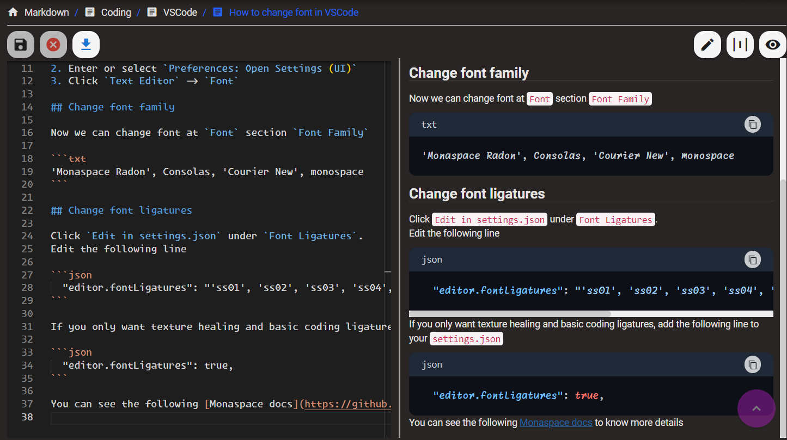

# Markdown editor (makrdown-editor)

[](https://sonarcloud.io/summary/new_code?id=JunHaoShih_markdown-editor)

Simple markdown editor  
Hosted on Firebase  
[Click here](https://markdown-editor-da01c.web.app/) to try it

## Features

1. Markdown editor with real-time display  

3. Cloud storage and personal workspace  

4. Mermaid support in Markdown  

5. Mobile support  


## Install the dependencies
```bash
yarn
# or
npm install
```

### Start the app in development mode (hot-code reloading, error reporting, etc.)
```bash
quasar dev
```


### Lint the files
```bash
yarn lint
# or
npm run lint
```


### Build the app for production
```bash
quasar build
```

### Customize the configuration
See [Configuring quasar.config.js](https://v2.quasar.dev/quasar-cli-vite/quasar-config-js).
